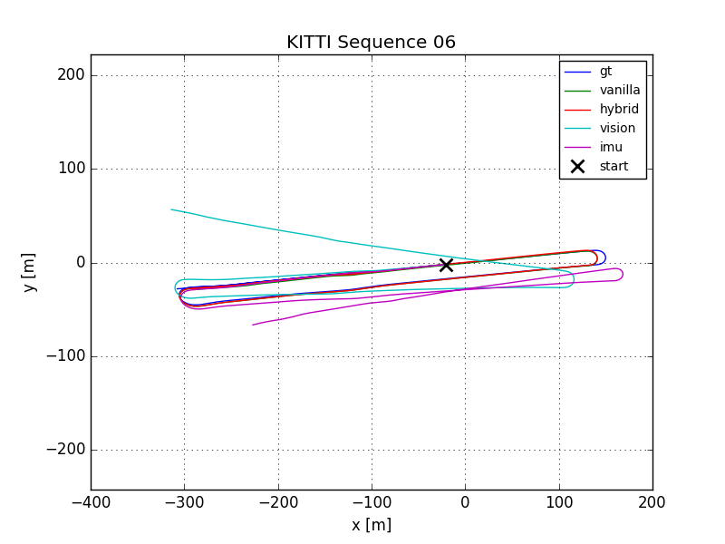
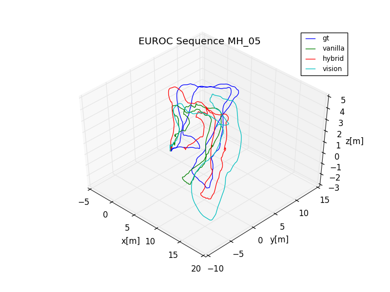

# Deep EKF VIO
This is the continuation of using an EKF as part of an end-to-end learnable network (https://github.com/lichunshang/end_to_end_odometry) 
to fuse vision and IMU. In this work
an robocentric EKF formulation is used as part of a deep CNN LSTM network to learn visual inertial odoemtry in an end to 
end manner. Good results are obtained in the KITTI dataset, however it performs poorly in the EUROC MAV dataset due to
its CNN-LSTM not generalizing well to 3D motion on small amount of data. You can find more details regarding this work in 
https://github.com/lichunshang/deep_ekf_vio/blob/master/docs/report.pdf including all the derivations and diagrams.
This repository started out as a fork to https://github.com/ChiWeiHsiao/DeepVO-pytorch, however it has been changed
extensively.

## Dependencies:
Look at `docker/cuda10.1/Dockerfile` for list of dependencies

## Example Usage:
Help:
`python main.py -h`

Preprocessing:
`preprocess_kitti_seqs.sh`
`preprocess_euroc_seqs.sh`

Training:
`python3 main.py --description <experiment_desciprtion> --gpu_id 0`

Evaluation:
`python3 results_directory/main.py  --gpu_id 0 --run_eval_only`

## System Architecture:

## KITTI Examples:
Sequence 06

Sequence 10

## EUROC Examples:
MH_05

